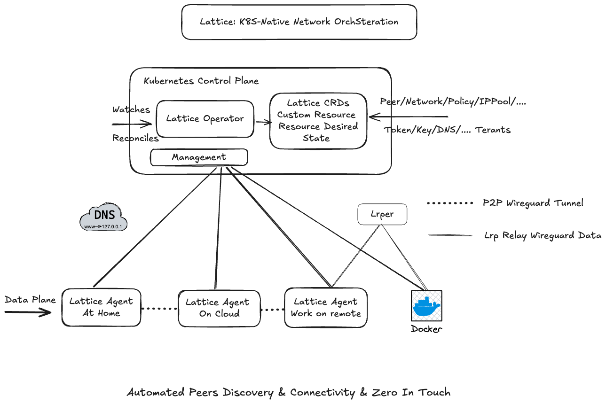

<div align="center">

# Lattice

**AI-Native WireGuard Overlay Networking**

[](LICENSE)
[](https://goreportcard.com/report/github.com/alatticeio/lattice)
[](https://github.com/alatticeio/lattice/releases/latest)
[](https://github.com/alatticeio/lattice/pkgs/container/lattice)
[](CONTRIBUTING.md)

[](https://github.com/alatticeio/lattice/actions/workflows/bench.yml)
[](https://github.com/alatticeio/lattice/actions/workflows/bench.yml)
[](https://github.com/alatticeio/lattice/actions/workflows/bench.yml)

Lattice is a self-hosted WireGuard orchestration platform that connects any device — laptops, servers, IoT, Kubernetes pods, and AI agents — into a single encrypted overlay network, without touching firewalls or exposing public IPs. It is the only overlay mesh with a built-in AI-native networking stack: MCP server for AI assistant integration, zero-trust agent enrollment for AI workloads, and a natural-language network intent engine.

[**Website**](https://lattice.run) · [**Documentation**](https://lattice.run/docs) · [**Issues**](https://github.com/alatticeio/lattice/issues)

</div>

---

## Why Lattice?

Most overlay mesh solutions make you choose: either a SaaS-controlled mesh (Tailscale) or a self-hosted mesh with limited management tools (Netbird / Headscale). Neither treats AI workloads as a first-class citizen.

**Lattice gives you both — a self-hosted control plane with a full management console, plus the only built-in AI-native networking stack in the overlay mesh space.**

Deploy the entire control plane on your infrastructure — bare metal, Docker, or Kubernetes — and manage your network through a web dashboard. No third-party coordination servers, no data leaving your network.

- **Self-hosted dashboard** — Manage peers, policies, monitoring, and workspaces through a web UI, not just CLI
- **K8s-native + device-native** — The same mesh works for Kubernetes clusters (via CRD operator) and personal devices (via `lattice up`)
- **Full data sovereignty** — Your keys, your traffic, your infrastructure stays on your infrastructure
- **AI-native networking** — MCP server for AI assistant management, zero-trust enrollment for AI agent fleets (TTL identities + kernel-level isolation), and a natural-language intent engine — none of which exist in competing products
- **Open core** — Apache 2.0 community edition with optional Pro features (AI intent engine, eBPF policy, SSO, compliance reporting)

### AI Feature Comparison

| Capability | Lattice | Tailscale | Netbird | ZeroTier |
|---|---|---|---|---|
| MCP Server (AI assistant manages network via natural language) | ✅ Built-in | ❌ | ❌ | ❌ |
| AI Agent Zero-Trust Enrollment (TTL + network isolation presets) | ✅ API + Python SDK | ❌ | ❌ | ❌ |
| Network Intent Engine (natural language → CRD plan → apply) | ✅ (Pro) | ❌ | ❌ | ❌ |
| Write-op approval workflow (human-in-the-loop for AI changes) | ✅ Built-in | N/A | N/A | N/A |
| Compliance-as-Conversation | 🔜 (Pro) | ❌ | ❌ | ❌ |

---

## Overview

Lattice is a WireGuard orchestration platform for Kubernetes and beyond. It automates the full lifecycle of secure peer-to-peer tunnels:

- **Control Plane** — Kubernetes Operator (or all-in-one standalone mode) that declaratively manages network topology. Acts as the single source of truth for keys, IP allocation, and peer relationships.
- **Data Plane** — Lightweight (~12 MB) agent deployed on any device — K8s pods, laptops, servers, or edge. Establishes encrypted WireGuard tunnels with automatic NAT traversal (ICE/STUN/TURN), even across symmetric NATs.
- **Relay Plane** — Built-in LRP relay server as fallback when direct P2P is not possible.
- **AI Plane** — MCP server for AI assistant (Claude, Cursor) network management; zero-trust enrollment API + Python SDK for AI agent fleets; natural-language intent engine that translates plain-English requests into CRD change plans.

## Architecture



## Features

| Feature | Status |
|---------|--------|
| WireGuard tunnel automation (key distribution, rotation) | ✅ |
| Automatic NAT traversal (ICE / STUN / TURN) | ✅ |
| Built-in IPAM — conflict-free IP allocation per workspace | ✅ |
| CRD-based declarative network topology | ✅ |
| Network policy engine (allow/deny, ingress/egress, port-level) | ✅ |
| Multi-workspace & RBAC | ✅ |
| Web Dashboard | ✅ |
| All-in-One deployment (embedded NATS + SQLite, no external deps) | ✅ |
| Telemetry export (VictoriaMetrics push) | ✅ |
| Multi-region / multi-cloud bridging | 🔜 |
| Smart DNS (internal service naming) | 🔜 |
| **— AI-Native —** | |
| **MCP Server — manage network via natural language (Claude Desktop, Cursor)** | ✅ |
| **AI Agent Zero-Trust Enrollment — TTL identities, network isolation presets** | ✅ |
| **Python Agent SDK — `async with LatticeAgent(...)`** | ✅ |
| **Network Intent Engine (Pro) — natural language → CRD change plan → diff → apply** | ✅ |
| **Compliance-as-Conversation (Pro)** | 🔜 |
| **Time-Travel Network Debugging (Pro)** | 🔜 |

---

## Installation

### Homebrew (macOS / Linux)

```bash
brew tap alatticeio/tap
brew install lattice
```

> **Note:** If prompted for GitHub credentials, you've hit GitHub's API rate limit.
> Authenticate brew with a [Personal Access Token](https://github.com/settings/tokens):
>
> ```bash
> export HOMEBREW_GITHUB_API_TOKEN=<your-token>
> brew tap alatticeio/tap
> brew install lattice
> ```

### YUM (RHEL / CentOS / Rocky / Fedora)

Create `/etc/yum.repos.d/lattice.repo`:

```ini
[lattice]
name=Lattice
baseurl=https://alatticeio.github.io/lattice/rpm
enabled=1
gpgcheck=0
```

```bash
sudo yum install lattice
sudo systemctl enable --now lattice
```

### APT (Debian / Ubuntu)

```bash
curl -fsSL https://alatticeio.github.io/lattice/deb/Packages.gz -o /tmp/lattice-Packages.gz
echo "deb [trusted=yes] https://alatticeio.github.io/lattice/deb ./" | sudo tee /etc/apt/sources.list.d/lattice.list
sudo apt update
sudo apt install lattice
sudo systemctl enable --now lattice
```

### Docker

```bash
docker run -d \
  --name lattice \
  --restart unless-stopped \
  --privileged \
  --network host \
  -v ~/.lattice:/root/.lattice \
  ghcr.io/alatticeio/lattice:latest \
  up
```

Before running, configure via `lattice init` (or pass flags directly: `up --server-url http://<host>:8080 --token <token>`).

### Binary Download

Download pre-built binaries from [GitHub Releases](https://github.com/alatticeio/lattice/releases).

```bash
# Linux amd64 — replace VERSION with the desired release tag (e.g. v0.5.0)
VERSION=$(curl -s https://api.github.com/repos/alatticeio/lattice/releases/latest | grep tag_name | cut -d'"' -f4)
curl -sSL "https://github.com/alatticeio/lattice/releases/download/${VERSION}/lattice_${VERSION}_linux_amd64.tar.gz" | tar xz
sudo mv lattice /usr/local/bin/
```

---

## Quick Start

### Docker (single command, no Kubernetes required)

```bash
docker run -d \
  --name lattice-k3s \
  --privileged \
  -p 8080:8080 \
  ghcr.io/alatticeio/lattice-k3s:latest
```

This starts a self-contained container with k3s (lightweight Kubernetes) and the Lattice control plane already deployed inside. After ~30 seconds:
- Dashboard / API: `http://localhost:8080`

### Existing Kubernetes cluster (kustomize)

```bash
kubectl apply -k https://github.com/alatticeio/lattice/config/lattice/overlays/all-in-one
```

---

## Connecting an Agent

### 0. One-time setup (interactive)

```bash
lattice init
```

Follow the prompts to enter your server URL and enrollment token. Config is saved to `~/.lattice/lattice.yaml`. After this, all commands read from config — no flags needed.

### 1. Create a workspace

```bash
lattice workspace add dev \
  --display-name "Development"
```

```bash
# List all workspaces
lattice workspace list
```

### 2. Create an enrollment token

```bash
lattice token create dev-team \
  -n <namespace> \
  --limit 10 \
  --expiry 168h
```

| Flag | Description |
|------|-------------|
| `-n` / `--namespace` | Workspace namespace (from `workspace list`) |
| `--limit` | Max agent connections (0 = unlimited) |
| `--expiry` | Token lifetime (e.g. `24h`, `168h`, omit = never) |

### 3. Start an agent

```bash
lattice up
```

Reads config from `~/.lattice/lattice.yaml` (set up via `lattice init`). Flags still override file values when needed.

Run as a container (mount the config directory):

```bash
docker run -d \
  --name wf-agent \
  --restart unless-stopped \
  --privileged \
  --network host \
  -v ~/.lattice:/root/.lattice \
  ghcr.io/alatticeio/lattice:latest \
  up
```

### 4. Allow traffic between peers

Lattice enforces a **default-deny** policy — agents can establish tunnels but cannot exchange traffic until a policy explicitly permits it. This prevents accidental exposure in multi-tenant environments.

**CLI — allow all traffic in a workspace (development / single-tenant):**

```bash
lattice policy allow-all \
  -n <namespace>
```

**CLI — fine-grained policy:**

```bash
lattice policy add my-policy \
  -n <namespace> \
  --action ALLOW \
  --desc "allow all peer traffic"
```

**Dashboard — visual policy editor:**

Navigate to `http://localhost:8080` → **Policies** → **Create Policy**.

You can define rules scoped to specific peers (by label), ports, and direction (ingress / egress).

**kubectl — apply a policy CRD directly:**

```yaml
apiVersion: alattice.io/v1alpha1
kind: LatticePolicy
metadata:
  name: allow-all
  namespace: default
  labels:
    action: ALLOW
  annotations:
    description: "Full mesh — allow all peer traffic"
    policyTypes: "Ingress,Egress"
spec:
  action: ALLOW
  peerSelector: {}   # matches all peers in the namespace
  ingress: []        # empty = no port restriction
  egress: []
```

```bash
kubectl apply -f policy-allow-all.yaml
```

### 5. Verify connectivity

Check the local agent status and peer list:

```bash
lattice status
```

Example output:

```
Interface : wg0
Address   : 10.100.0.1/24
Public Key: abc123...=
Port      : 51820

Peers: 2 total, 2 connected

  Peer      : xyz456...=
  Address   : 10.100.0.2/32
  Endpoint  : 203.0.113.5:51820
  Handshake : 8 seconds ago
  Traffic   : ↑ 1.2 MB  ↓ 3.4 MB
  Status    : connected

  Peer      : def789...=
  Address   : 10.100.0.3/32
  Endpoint  : 198.51.100.7:51820
  Handshake : 22 seconds ago
  Traffic   : ↑ 0.5 MB  ↓ 2.1 MB
  Status    : connected
```

**Ping between nodes to confirm the tunnel is working:**

On **Node A** (address `10.100.0.1`), ping Node B:

```bash
ping 10.100.0.2
```

Expected output when the tunnel is up:

```
PING 10.100.0.2 (10.100.0.2): 56 data bytes
64 bytes from 10.100.0.2: icmp_seq=0 ttl=64 time=4.3 ms
64 bytes from 10.100.0.2: icmp_seq=1 ttl=64 time=3.8 ms
```

If ping times out, the tunnel has not been established. Common causes:
- The policy is still default-deny — run `lattice policy allow-all -n <namespace>` to permit traffic.
- The peer has not yet completed a WireGuard handshake — check `lattice status` on both nodes and wait a few seconds.
- A firewall is blocking UDP on port 51820 — Lattice will attempt TURN relay fallback automatically.

---

### 6. Clean up resources

Remove a specific agent from the workspace:

```bash
lattice token remove <token>
```

Delete a workspace and all its peers:

```bash
lattice workspace remove <namespace>
```

Remove a policy:

```bash
lattice policy remove <name> -n <namespace>
```

Uninstall the control plane from Kubernetes:

```bash
kubectl delete -k https://github.com/alatticeio/lattice/config/lattice/overlays/all-in-one
```

---

## CLI Reference

All management commands (`workspace`, `token`, `policy`) use `--server-url` to reach the control plane. The NATS signaling URL is auto-discovered — no need to configure it separately. Use `lattice init` for interactive first-time setup.

### Setup & Agent

```bash
lattice init     # Interactive first-time setup (saves to ~/.lattice/lattice.yaml)
lattice up       # Connect to the mesh (reads config, zero flags needed after init)
lattice status   # Show local WireGuard status and peer list
```

### Workspace

```bash
lattice workspace add <slug> [--display-name <name>] [-n <namespace>]
lattice workspace list
lattice workspace remove <namespace>
```

### Token

```bash
lattice token create <name> [-n <namespace>] [--limit <n>] [--expiry <duration>]
lattice token list  [-n <namespace>]
lattice token remove <token>
```

### Policy

```bash
lattice policy allow-all -n <namespace>
lattice policy add <name>  -n <namespace> [--action ALLOW|DENY] [--desc <text>]
lattice policy list  -n <namespace>
lattice policy remove <name> -n <namespace>
```

---

## AI Assistant Integration (MCP)

Lattice ships with an [MCP](https://modelcontextprotocol.io) server (`lattice-mcp`) that lets
Claude Desktop, Cursor, and other MCP-compatible AI assistants manage your network with natural language.

### Setup

1. Install `lattice-mcp`:
   ```bash
   go install github.com/alatticeio/lattice/cmd/lattice-mcp@latest
   ```

2. Log in to your Lattice server:
   ```bash
   lattice login
   ```

3. Find your workspace ID:
   ```bash
   lattice workspace list
   ```

4. Add to Claude Desktop (`~/.config/claude/claude_desktop_config.json`):
   ```json
   {
     "mcpServers": {
       "lattice": {
         "command": "lattice-mcp",
         "args": ["--workspace", "YOUR_WORKSPACE_ID"]
       }
     }
   }
   ```

5. Restart Claude Desktop. You can now ask:
   > "List all peers in my network"
   > "Create a policy that allows frontend to reach api-gateway on port 443"
   > "Why can't payment-service reach postgres?"
   > "Show me all offline peers"

### Available Tools

| Tool | Type | Description |
|------|------|-------------|
| `list_peers` | Read | List all WireGuard peers with status |
| `list_policies` | Read | List all access control policies |
| `list_networks` | Read | List all networks and CIDRs |
| `check_connectivity` | Read | Check if two peers can communicate |
| `audit_workspace` | Read | Security audit of workspace policies |
| `plan_network_change` | Read (Pro) | Translate natural language intent into a CRD change plan diff |
| `apply_network_change` | Write (Pro) | Execute an approved change plan (requires admin approval) |
| `create_policy` | Write | Create an access control policy |
| `delete_policy` | Write | Delete a policy |
| `create_peer` | Write | Create a new peer node |
| `delete_peer` | Write | Delete a peer node |

Write operations require approval in the Lattice dashboard unless `ai.workflow.auto_approve` is configured:

```yaml
ai:
  enabled: true
  api-key: sk-...
  workflow:
    auto_approve:
      create_policy: false  # require approval (default)
      delete_peer: false    # require approval (default)
```

---

## AI Agent Networking

Lattice provides **Zero-Trust networking for AI agent clusters**. When running multi-agent
systems (AutoGen, LangGraph, Claude Agent SDK), each agent gets a unique WireGuard
identity and network isolation enforced at the kernel level — even if an agent is
compromised by a prompt injection attack, it cannot reach services outside its policy preset.

### Python SDK

```bash
pip install lattice-sdk
```

```python
from lattice_sdk import LatticeAgent

async with LatticeAgent(
    server="https://lattice.company.com",
    token="lt-workspace-token",
    workspace_id="ws-prod-agents",
    agent_name="code-executor",
    agent_type="code-executor",
    ttl_seconds=3600,
    policy_preset="sandboxed",   # no ingress, egress to tool services only
) as agent:
    # WireGuard tunnel is up; agent.peer_name and agent.enrollment_token are set
    result = await run_agent_task()
# Tunnel torn down automatically on exit
```

### Policy Presets

| Preset | Behaviour |
|--------|-----------|
| `sandboxed` | Egress allowed; all ingress denied |
| `coordinator` | Accepts ingress from same-workspace agents |
| `isolated` | No network access (whitelist only) |

### REST API

```bash
# Enroll an agent
curl -X POST https://lattice.company.com/api/v1/agent-enroll \
  -H "Authorization: Bearer $TOKEN" \
  -H "Content-Type: application/json" \
  -d '{"agentName":"executor-1","agentType":"code-executor","workspaceId":"ws-xxx","ttlSeconds":3600,"policyPreset":"sandboxed"}'

# Revoke an agent before TTL expiry
curl -X DELETE "https://lattice.company.com/api/v1/agent-enroll/agent-executor-1?workspaceId=ws-xxx" \
  -H "Authorization: Bearer $TOKEN"
```

---

## Configuration Reference

The control plane is configured via a YAML file (default: `/etc/lattice/lattice.yaml`):

```yaml
app:
  listen: :8080
  name: "Lattice"
  env: "production"
  init_admins:
    - username: "admin"
      password: "changeme"        # ⚠ Change before deploying

jwt:
  secret: "replace-with-random-secret"   # ⚠ Use a 32-byte random value
  expire_hours: 24

database:
  dsn: "data/lattice.db"                # SQLite (all-in-one)
  # dsn: "root:pass@tcp(mariadb:3306)/lattice?charset=utf8mb4&parseTime=True"  # MariaDB
```

---

## Development

### Requirements

- Go 1.25+
- Docker 20.10+
- k3d 5.x+ (for local cluster)
- kubectl 1.20+

### Build from source

```bash
git clone https://github.com/alatticeio/lattice.git
cd lattice
make build-all
```

---

## Contributing

Contributions are welcome. Please read [CONTRIBUTING.md](CONTRIBUTING.md) before submitting a pull request.

<a href="https://github.com/alatticeio/lattice/graphs/contributors">
  
</a>

---

## Disclaimer

This tool is intended for legitimate technical research, enterprise private networking, and compliant remote access scenarios only. Users are responsible for ensuring their use complies with all applicable local laws and regulations. The authors assume no liability for any misuse of this software.

## License

[Apache License 2.0](LICENSE)
